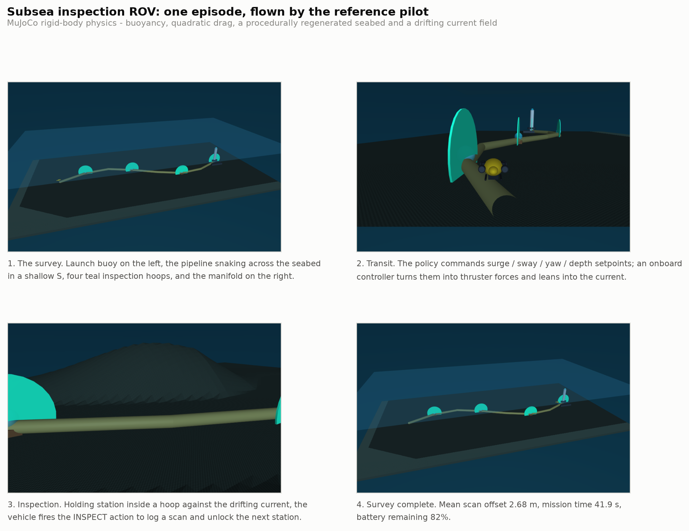

# Subsea Inspection ROV — Mission-Based Reinforcement Learning

An autonomous underwater vehicle (ROV) has to set out from a launch buoy, follow a
pipeline that snakes across the seabed, and inspect four stations spaced along it —
in order — by holding station inside each inspection hoop against a drifting current
and triggering a sensor scan, all before the battery runs flat and without driving
into the seabed, the pipe or the manifold.

Four RL algorithms are trained on that mission and compared: **DQN** (value-based),
and **REINFORCE**, **PPO** and **A2C** (policy-gradient).

Simulated in **MuJoCo** with real rigid-body physics: near-neutral buoyancy, quadratic
hydrodynamic drag, a procedurally generated seabed heightfield, and an
Ornstein–Uhlenbeck current field, with every force (thrust, buoyancy, drag, current)
applied through the body's external-force channel.



---

## Quickstart

```bash
git clone <repo-url> && cd nick-lemy_kayiranga_rl_summative
uv sync
uv run main.py
```

`uv sync` creates the environment and installs everything (Python is pinned to 3.11
and torch to the CPU wheels, so this stays a few hundred MB rather than pulling the
whole CUDA stack). `uv run main.py` opens the interactive 3D simulation flying the
best trained agent.

No other setup is needed — no manual venv, no `pip install`.

### Everything else

| Command | What it does |
|---|---|
| `uv run main.py` | Live 3D simulation with the best trained agent, in real time |
| `uv run main.py env-info` | Print the full action / observation / reward specification |
| `uv run main.py play --algo ppo --render` | Verbose rollout: 3D viewer **and** step-by-step terminal telemetry |
| `uv run main.py evaluate` | Score every agent, including the generalisation tests |
| `uv run main.py plots` | Regenerate every figure in the report |
| `uv run main.py video --algo ppo` | Record an MP4 with a telemetry HUD |
| `uv run main.py export-trace` | Write a JSON episode for the browser viewer |
| `uv run main.py train --algo ppo` | Run the 10-configuration PPO sweep |
| `uv run main.py train --algo ppo --final` | Retrain the sweep winner for longer |
| `uv run pytest -q` | Environment contract tests |

`uv run python play.py --algo dqn --render` works directly too.

The viewer plays back at **real time** by default: one second of simulated time takes
one second of wall clock, so a full survey runs about 45–55 s. `--speed 0.5` gives
slow motion and `--speed 3` skips ahead, on both `demo` and `play`.

---

## The environment

### Why it is not a grid world

The directional actions do **not** move the vehicle. They nudge the setpoints of an
onboard velocity/heading controller, which — together with buoyancy, quadratic drag
and the current — is summed into the body's external-force channel and integrated by
MuJoCo. A bad sequence of actions genuinely lets the current sweep the vehicle off the
line or drives it into the seabed.

Two design decisions came out of actually flying it (see `tests/scripted_pilot.py`):

- **The actions command velocities, not raw thruster forces.** Commanding a velocity
  means the onboard controller automatically leans into the current to hold it, so
  station-keeping falls out of the physics rather than having to be scripted — and a
  10 Hz discrete policy can fly the vehicle smoothly.
- **The commanded setpoints are part of the observation.** Because the actions edit
  persistent state, omitting them would make the problem non-Markovian.

### Action space — `Discrete(10)`

| # | Action | Real-world meaning |
|---|---|---|
| 0 | `HOLD` | bleed the translational setpoints to zero and station-keep |
| 1 | `SURGE_FWD` | drive forward along the heading |
| 2 | `SURGE_REV` | back off |
| 3 | `YAW_LEFT` | rotate heading to port |
| 4 | `YAW_RIGHT` | rotate heading to starboard |
| 5 | `STRAFE_LEFT` | translate to port on the lateral thrusters |
| 6 | `STRAFE_RIGHT` | translate to starboard |
| 7 | `ASCEND` | rise |
| 8 | `DESCEND` | dive |
| 9 | `INSPECT` | fire the sensor scan — the mission-critical act |

### Observation space — `Box(28,)`

Position error and velocity to the active station in the yaw-aligned frame, the
body-frame up-vector (attitude), heading, body rates, battery, survey progress, the
onboard current estimate, altitude above the seabed, range to the station, clock
remaining, vertical speed, pipeline-corridor margin, an in-scan-range flag, and the
four commanded setpoints. Run `uv run main.py env-info` for the exact index map.

### Reward

| Term | Value |
|---|---|
| Progress towards the active station | **+1.3** per metre closed |
| Clean inspection scan | **+60 · exp(−(offset/2.8)²)** |
| Scan inside the 2.8 m hoop | **+30** |
| Full survey completed | **+120** |
| `INSPECT` with no station in range | **−1** |
| Time / energy / tilt / spin | −0.05 / −0.04 / −0.2 / −0.02 per step |
| Off-pipeline / seabed proximity | shaped penalties |
| Collision, capsize, lost, flat battery | **−50 to −55** each |
| Ran out of time | **−12** per un-inspected station |

### Start state and termination

Launch from the buoy at the near end of the pipeline with 85–100% battery and
near-neutral buoyancy. Every reset draws a **fresh procedural seabed and a fresh
current field**, which is what the generalisation test exploits.

Episodes end on `survey_complete`, `collision`, `capsized`, `lost`,
`battery_depleted`, or timeout.

### Reference scores

Measured over the held-out seeds, so the learned policies have something to be
compared against:

| Policy | Mean return | Surveys complete |
|---|---|---|
| Uniform random | −432.8 | 0% |
| Do nothing (`HOLD` forever) | −144.4 | 0% |
| Hand-written pilot (`tests/scripted_pilot.py`) | +360.0 | 90% |

Random is *worse* than doing nothing here: thrashing the thrusters drives the vehicle
into the seabed or out of the box and collects the terminal penalties, whereas holding
station merely drifts and times out — a shallow local optimum the learned agents have
to climb out of.

---

## Browser replay viewer

Episodes serialise to a self-contained JSON document and replay in the browser, which
is what an operations dashboard would do against a `GET /episodes/:id` endpoint. The
page rebuilds the seabed, pipeline, hoops, manifold and the vehicle from the JSON alone
— it knows nothing about MuJoCo.

```bash
uv run main.py export-trace          # writes viewer/episode.json
python3 -m http.server 8000 -d viewer
# open http://localhost:8000
```

Scrub, change playback speed, switch between chase / orbit / mission cameras, and
watch the reward, battery and survey progress update per step. three.js is vendored
locally, so it works offline.

The schema is `subsea-rl-trace/1`: a header (seabed heightfield, pipeline polyline,
waypoints, survey bounds, action names) plus one record per control step with the
vehicle pose, the action index, the step reward, the battery, the active station and
the current vector.

---

## Repository layout

```
├── pyproject.toml            # uv project definition (CPU torch pinned)
├── uv.lock                   # locked dependency graph
├── main.py                   # entry point / CLI
├── play.py                   # run a trained agent with verbose telemetry
│
├── environment/
│   ├── custom_env.py         # the Gymnasium environment
│   └── rendering.py          # MuJoCo viewer, HUD renderer, MP4 recording
│
├── training/
│   ├── common.py             # shared env factory, evaluation protocol, sweep runner
│   ├── reinforce.py          # REINFORCE, written from scratch (SB3 has none)
│   ├── dqn_training.py       # 10-configuration DQN sweep
│   └── pg_training.py        # 10-configuration PPO / A2C / REINFORCE sweeps
│
├── analysis/
│   ├── evaluate.py           # scoring and the generalisation tests
│   ├── plots.py              # every figure in the report
│   └── style.py              # shared palette and figure styling
│
├── models/{dqn,pg}/          # trained policies
├── logs/                     # eval histories, SB3 scalars, results tables
├── assets/                   # MuJoCo scene, figures, recorded video
├── viewer/                   # three.js replay viewer
└── tests/                    # contract tests + the hand-written reference pilot
```

---

## Reproducing the results

```bash
uv run main.py train --algo ppo          # 10 configurations x 200k steps
uv run main.py train --algo a2c
uv run main.py train --algo reinforce
uv run main.py train --algo dqn

uv run main.py train --algo ppo --final  # retrain the winner for 1.5M steps
uv run main.py evaluate                  # scores + generalisation
uv run main.py plots                     # figures
```

Every configuration is scored on the **same held-out block of seeds**, never on
training reward, so the four algorithms stay comparable. A second, disjoint seed block
is reserved for the generalisation test, which also perturbs the current, the energy
budget and the seabed roughness beyond anything seen in training.

Results land in `logs/results/*_sweep.csv` (the hyperparameter tables),
`logs/results/generalization.csv`, and `assets/figures/`.

---

## Notes

- Training runs on CPU by design — the policies are small MLPs and the environment is
  the bottleneck. `torch.set_num_threads(1)` measured ~1.9× faster end-to-end than the
  default, because torch's thread pool otherwise fights the environment workers.
- The MuJoCo scene regenerates its seabed heightfield on every reset; both renderers
  re-upload it to the GPU, or the render would show relief the physics is no longer
  using.

**Nick Lemy Kayiranga** — n.kayiranga@alustudent.com
